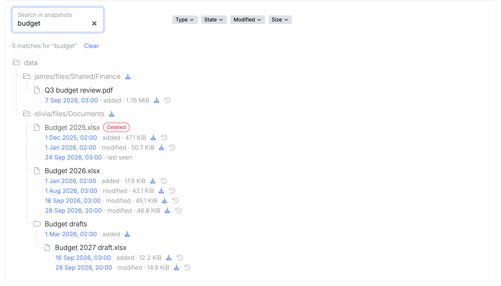

Many firms keep their files in OneDrive because it came with Microsoft 365, often without anyone having chosen it. A virgoOS node does the same job with Nextcloud, on a server in your own office. This post compares the two on the points where that difference matters: whose the files are, what you keep paying, and what you can get back.

## The same job

Day to day, you give nothing up. Both give every person a place for their files, keep those files in sync between their devices, and let them share a file with a colleague or send a link to someone outside.

Nextcloud has sync apps for Windows, macOS and Linux, and apps for Android and iOS. A file or folder can be shared with other users and groups, or through a link that can be protected with a password and set to expire. A link can also be made upload-only, so a client can hand you documents without seeing what others have sent.

On a node, Nextcloud is installed from the App center. Euro Office, installed next to it, adds editing documents together in the browser.

## Where the files are

With OneDrive, the files are in Microsoft's data centres. For customers who signed up in the EU, Microsoft commits to storing and processing them inside the EU and EFTA, with limited cases in which data is still transferred outside.

With a node, the files are on drives in your office. There is no region to choose and no commitment to read, because the files do not go anywhere.

## Yours, and nobody else's

With a node, you own your data and nobody else does. The files are on hardware that belongs to you, and no one else keeps a copy of them: not a cloud provider, and not univrs either. The fleet only manages the node and holds none of your files.

With a cloud provider, the files are yours by contract, but someone else keeps them. That leads to the next question, which is what is done with them there.

AI already works on the files kept in Microsoft 365. Where Copilot is in use, it reads a person's documents, emails and chats to answer them, and Microsoft offers models from OpenAI and Anthropic, as its subprocessors, to power it. What else may be done with the files is set by the provider's terms: you cannot check it yourself, you take it on trust, and the terms can change.

On a node there is nothing to take on trust. The files never reach a provider, so nobody is in a position to analyse them, build a profile from them or train an AI model on them, today or after the next change of terms. For a firm that keeps other people's confidential documents, that is the easier answer to give a client who asks.

## What it costs

OneDrive is licensed per user, as part of a Microsoft 365 plan, at the price Microsoft sets. The business plans come with 1 TB of storage for each user. Every new colleague is one more licence, and you keep paying for each of them for as long as they work with you. It is a rent that never ends.

virgoOS and Nextcloud are open source, and neither has a fee per user. What you pay for is the server and its drives. The space is what the drives hold, shared by everyone, so a new colleague costs nothing and more space means bigger drives. You buy something you then own.

## Getting a file back

This is where owning the storage changes the most.

In OneDrive for work, a deleted file can be restored for 93 days, unless your administrator changed that. The whole OneDrive can be rolled back to a moment in the last 30 days. Past those limits, a file that has left the recycle bin cannot be recovered.

Nextcloud has a trash bin of its own, which keeps deleted files for at least 30 days. Under it, the node's storage pool keeps a history of everything: a snapshot for each of the last 36 hours, 30 days, 60 months and 5 years. A file deleted months ago, or quietly overwritten last year, can still be in one of them. The older snapshots are further apart, so they hold the file as it was at the start of a month or of a year.

You do not have to know which one. The node catalogues the files in Nextcloud's snapshots every hour, so you search for a file by name and see every version it kept, including the ones that were deleted.

The same history is what you fall back on if ransomware encrypts the files: the snapshots are read-only, so the versions from before are still there.

## Sharing with people outside

A link from Nextcloud points straight at your node. The person who opens it gets the file from your office, not from a copy that a third party keeps, and no copy of it is ever left with a provider.

For that, the node has to be reachable from the internet: your connection needs a public IP address, and [a few ports forwarded](https://docs.univrs.cloud/setup/ports/) on your router. Inside your network and over [the VPN](/blog/vpn-on-virgoos/), Nextcloud works without either.

## What it comes down to

- **The files are yours.** They are on hardware you own, in your office, and nobody else keeps a copy.
- **No provider's AI reads them.** Nothing is analysed, profiled or used for training, because nothing leaves the node.
- **You stop renting.** There is no licence per user and no bill that grows with the firm.
- **You get files back.** The node keeps up to five years of history and lets you search it, where OneDrive's recycle bin stops at 93 days.

OneDrive asks you to trust a provider with your firm's files and to keep paying for it. A node asks for neither.

## Where to go next

- [Snapshots](https://docs.univrs.cloud/management/resources/apps/snapshots/) covers restore points and searching for earlier and deleted files.
- [Apps](https://docs.univrs.cloud/management/resources/apps/) covers installing Nextcloud and Euro Office from the App center.
- [What virgoOS is, and what runs on it](/blog/what-virgoos-is/) is the short tour of the rest.
