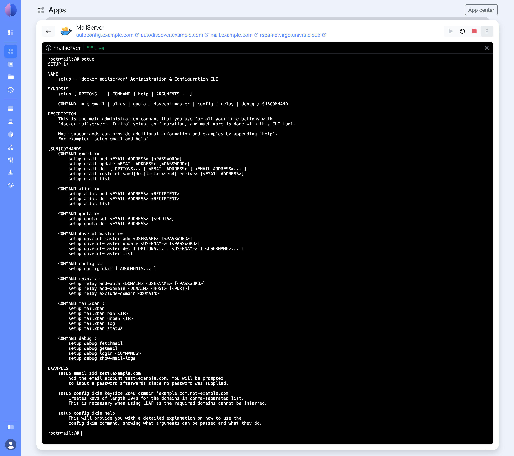

A virgoOS node can run your firm's email: addresses on your own domain, mailboxes on your own drives, no licence per mailbox. Of everything a node does, this is the part that asks the most of you. There are DNS records to create, a router to configure, and the mailboxes are managed by typing commands, not by clicking.

This post goes through all of it in order. The examples use `example.com` as the domain and `203.0.113.10` as the public IP address. Replace them with yours.

## Before anything else: your connection

Email is the one app where the internet connection decides whether it can work at all. Check these before you install anything.

**A public IP address of your own.** Other mail servers have to reach yours directly. Behind CGNAT, where the provider shares one address between many customers, they cannot. [The ports guide](https://docs.univrs.cloud/setup/ports/) shows how to tell which kind of connection you have.

**A static one.** The DNS records below point at your address. If it changes, mail stops arriving until they are corrected.

**Port 25 open in both directions.** Many providers block outgoing port 25 on home connections, to stop spam. Mail servers talk to each other on that port and nothing else will do. Ask your provider, and ask for a business connection if that is what it takes.

**Reverse DNS.** Your IP address has to resolve back to `mail.example.com`. That record, called PTR, belongs to whoever owns the address, so only your provider can set it. Without it, the large mail providers reject or junk what you send.

If your provider cannot give you all four, self-hosted email is not for this connection, and it is better to know now.

## Mail cannot go through a proxy

Managing the node works from anywhere through your fleet, with no ports forwarded. Email does not work that way. The fleet carries the management interface and nothing else, so mail has to reach the node directly, on your public IP address.

The same goes for DNS providers that offer to proxy your records, such as Cloudflare with its orange cloud. Those proxies carry web traffic only. A proxied `mail` record points at the proxy, which does not accept mail. Set every record in this post to DNS only.

## What you are installing

The MailServer app in the App center is [docker-mailserver](https://docker-mailserver.github.io/docker-mailserver/latest/), set up for a node. It receives and sends mail (SMTP), keeps the mailboxes and serves them to mail clients (IMAP), filters spam with Rspamd, scans attachments with ClamAV, and bans addresses that keep guessing passwords with fail2ban. Next to it run a small DNS resolver of its own and a service that tells mail clients how to configure themselves.

There is no webmail in it. People read their mail in a mail client: Thunderbird, Outlook, Apple Mail, or the mail app on their phone.

## Forward the ports

On your router, forward these TCP ports to the node:

| Port | What uses it |
| --- | --- |
| 25 | Other mail servers, delivering mail to you |
| 465 | Mail clients sending mail, encrypted from the start |
| 587 | Mail clients sending mail, with STARTTLS |
| 993 | Mail clients reading mail (IMAP) |
| 4190 | Mail clients managing server-side filters (Sieve) |
| 80 and 443 | Certificates, and the pages that configure mail clients |

## The DNS records to create first

Create these at your DNS provider before installing, so the node can get its certificates right away.

| Type | Name | Value |
| --- | --- | --- |
| A | `mail` | `203.0.113.10` |
| MX | `@` | `mail.example.com`, priority 10 |
| CNAME | `imap` | `mail.example.com` |
| CNAME | `smtp` | `mail.example.com` |
| A | `autoconfig` | `203.0.113.10` |
| A | `autodiscover` | `203.0.113.10` |
| TXT | `@` | `mailconf=https://autoconfig.example.com/mail/config-v1.1.xml` |
| SRV | `_imaps._tcp` | `0 0 993 mail.example.com` |
| SRV | `_submission._tcp` | `0 0 587 mail.example.com` |
| SRV | `_autodiscover._tcp` | `0 0 443 autodiscover.example.com` |

They fall into three groups:

- **Where mail goes.** The `mail` record gives the mail server its name, and the MX record tells the world that mail for `@example.com` is delivered to it.
- **Names mail clients guess.** Some clients try `imap.example.com` and `smtp.example.com` on their own, so both point at the mail server. The certificate is issued for `mail.example.com` only, so that is still the name to type when you configure a client by hand.
- **How mail clients find their settings.** The two `auto` names, the `mailconf` record and the three SRV records are what [configures mail clients](#setting-up-mail-clients) without anyone typing a server name. In an SRV value the four parts are priority, weight, port and server, and most DNS providers have a separate field for each.

Do not add an AAAA (IPv6) record for `mail`. The mail server is set up for IPv4 only.

## Install the app

In the App center, select **Install** on MailServer. The form asks for three things:

- **MX domain**, the domain your addresses end in: `example.com`. The mail server itself will answer as `mail.example.com`.
- **Domain**, the node's own domain. The spam filter's interface is served on the `rspamd` name under it, behind the node login.
- **HTTPS certificate** for that interface.

The certificate for `mail.example.com` always comes from Let's Encrypt, which is why port 80 and the `mail` record have to be in place.

## Where the commands are typed

From here on, everything is done with the mail server's `setup` command, and it runs inside the mail server's container. You do not need SSH for that.

In **Apps**, open MailServer. Under **Services** it has three containers. On the one named `mailserver`, select **Terminal**. A command line opens inside the container, in your browser, and that is where every `setup` command in this post goes.

The prompt reads `root@mail:/#`. Typed alone, `setup` lists everything it can do. Shortened, the list looks like this:



```console
root@mail:/# setup
SETUP(1)

NAME
    setup - 'docker-mailserver' Administration & Configuration CLI

[SUB]COMMANDS
    COMMAND email :=
        setup email add <EMAIL ADDRESS> [<PASSWORD>]
        setup email update <EMAIL ADDRESS> [<PASSWORD>]
        setup email del [ OPTIONS... ] <EMAIL ADDRESS> [ <EMAIL ADDRESS>... ]
        setup email restrict <add|del|list> <send|receive> [<EMAIL ADDRESS>]
        setup email list

    COMMAND alias :=
        setup alias add <EMAIL ADDRESS> <RECIPIENT>
        setup alias del <EMAIL ADDRESS> <RECIPIENT>
        setup alias list

    COMMAND quota :=
        setup quota set <EMAIL ADDRESS> [<QUOTA>]
        setup quota del <EMAIL ADDRESS>

    COMMAND config :=
        setup config dkim [ ARGUMENTS... ]

    COMMAND relay :=
        setup relay add-auth <DOMAIN> <USERNAME> [<PASSWORD>]
        setup relay add-domain <DOMAIN> <HOST> [<PORT>]
        setup relay exclude-domain <DOMAIN>

    COMMAND fail2ban :=
        setup fail2ban
        setup fail2ban ban <IP>
        setup fail2ban unban <IP>
        setup fail2ban log
        setup fail2ban status
```

What these commands change is kept with the app's data, on the storage pool, so it survives updates.

## Add the first mailbox, quickly

A freshly installed mail server has no accounts, and it will not finish starting without one. It waits two minutes, then stops and is started again. So the first command has a deadline:

```sh
setup email add olivia@example.com
```

It asks for the password, twice. If the terminal closes on you before you finish, the container has restarted: open **Terminal** again and repeat.

## Generate the DKIM key

DKIM signs every message you send, so the receiving server can check that it really comes from your domain. The key is generated on the node, once, after the first mailbox exists:

```sh
setup config dkim
```

The command prints the content of the DNS record you have to create, a long line that starts with `v=DKIM1; k=rsa; p=`. Copy it. It is also saved, in case you need it later:

```sh
cat /tmp/docker-mailserver/rspamd/dkim/rsa-2048-mail-example.com.public.dns.txt
```

The spam filter picks the key up by itself. Nothing has to be restarted.

## The DNS records that make your mail trusted

Three more TXT records, and then the list is complete: thirteen records at your DNS provider, plus the reverse DNS record at your internet provider.

| Type | Name | Value |
| --- | --- | --- |
| TXT | `mail._domainkey` | the line printed by `setup config dkim` |
| TXT | `@` | `v=spf1 mx ~all` |
| TXT | `_dmarc` | `v=DMARC1; p=none; rua=mailto:postmaster@example.com` |

- **DKIM** publishes the public half of the key you just generated. The value is longer than 255 characters, the most a single piece of a TXT record can hold. Most DNS providers split it for you. If yours refuses it, split it into several quoted pieces yourself.
- **SPF** says which servers may send mail for your domain. `mx` means the ones in your MX record, which is your node.
- **DMARC** tells receivers what to do with mail that fails both checks, and where to send reports. `p=none` only asks for reports. Once you see that your own mail passes, change it to `p=quarantine`.

The DMARC reports go to `postmaster@example.com`, and so do the server's own notices. Make that address land in a real mailbox:

```sh
setup alias add postmaster@example.com olivia@example.com
```

## Check your work

From any computer, ask DNS what the world now sees:

```sh
dig +short MX example.com
dig +short TXT example.com
dig +short TXT mail._domainkey.example.com
dig +short TXT _dmarc.example.com
dig +short SRV _imaps._tcp.example.com
dig +short -x 203.0.113.10
```

The last one is the reverse lookup and should answer `mail.example.com.`

Then send a message to an address at one of the large providers and look at its headers there. Gmail shows them under **Show original**, with SPF, DKIM and DMARC each marked as passed or failed. All three should pass before anyone relies on the server.

## Setting up mail clients

The node tells mail clients what the settings are, so in most of them a person types their name, their address and their password, and nothing else.

- **Thunderbird** looks the settings up at `autoconfig.example.com` by itself.
- **Outlook** asks `autodiscover.example.com`. How well that works depends on the Outlook version, so keep the manual settings at hand.
- **iPhone, iPad and Apple Mail** use a configuration profile. Open `https://autodiscover.example.com` on the device. The page has a form that produces the profile for an address, which is then installed from the device's settings.

The page at `https://autodiscover.example.com` is also where to send people who are stuck: it shows the settings for manual configuration.

For any client that finds nothing by itself, these are the settings:

| | Server | Port | Security |
| --- | --- | --- | --- |
| Incoming (IMAP) | `mail.example.com` | 993 | SSL/TLS |
| Outgoing (SMTP) | `mail.example.com` | 465 | SSL/TLS |

The username is the full email address, and the password is the one given to `setup email add`. For clients that insist on STARTTLS for sending, use port 587.

## Day to day

Everything below is typed in the same place, the **Terminal** of the `mailserver` container.

### Adding a mailbox

```sh
setup email add <address> [password]
```

| Argument | Required | Description |
| --- | --- | --- |
| `<address>` | Yes | The full email address of the new mailbox |
| `[password]` | No | Its password. Left out, the command asks for it, which keeps it out of the terminal's history |

### Changing a mailbox's password

```sh
setup email update <address> [password]
```

| Argument | Required | Description |
| --- | --- | --- |
| `<address>` | Yes | The mailbox whose password changes |
| `[password]` | No | The new password. Left out, the command asks for it |

### Deleting a mailbox

The aliases and the quota of the mailbox go with it.

```sh
setup email del [options] <address>
```

| Option | Required | Description |
| --- | --- | --- |
| `<address>` | Yes | The mailbox to delete. Several can be given at once |
| `-y` | No | Delete the person's mail too, without asking |
| `-n` | No | Keep the person's mail, without asking |

With neither option, the command asks whether to delete the mail, so an account can be closed while its mail is kept.

### Listing the mailboxes

```sh
setup email list
```

### Adding an alias

An alias is an address without a mailbox of its own.

```sh
setup alias add <alias> <recipient>
```

| Argument | Required | Description |
| --- | --- | --- |
| `<alias>` | Yes | The address people write to, such as `office@example.com` |
| `<recipient>` | Yes | The mailbox that receives its mail |

Add the same alias once for each person, and they all receive its mail.

### Removing someone from an alias

```sh
setup alias del <alias> <recipient>
```

| Argument | Required | Description |
| --- | --- | --- |
| `<alias>` | Yes | The alias |
| `<recipient>` | Yes | The mailbox that stops receiving its mail |

### Listing the aliases

The list shows where each alias delivers.

```sh
setup alias list
```

### Limiting a mailbox's size

```sh
setup quota set <address> [quota]
```

| Argument | Required | Description |
| --- | --- | --- |
| `<address>` | Yes | The mailbox to limit |
| `[quota]` | No | The limit, with a unit, such as `500M` or `5G`. `0` means no limit. Left out, the command asks for it |

Without a quota of its own, a mailbox can grow to 30 GB.

### Removing a mailbox's limit

```sh
setup quota del <address>
```

| Argument | Required | Description |
| --- | --- | --- |
| `<address>` | Yes | The mailbox that goes back to the default limit |

### Generating the DKIM key

The command also prints the DNS record for the key.

```sh
setup config dkim [options]
```

| Option | Required | Description |
| --- | --- | --- |
| `domain <name>` | No | The domain to generate the key for. The default is the domain given at install |
| `selector <name>` | No | The name the record is published under, in front of `._domainkey`. The default is `mail` |
| `keytype <type>` | No | `rsa` or `ed25519`. The default is `rsa` |
| `keysize <bits>` | No | `1024`, `2048` or `4096`, for `rsa` keys. The default is `2048` |
| `-f` | No | Replace a key that already exists |

### Listing the banned addresses

```sh
setup fail2ban
```

### Letting a banned address back in

```sh
setup fail2ban unban <ip>
```

| Argument | Required | Description |
| --- | --- | --- |
| `<ip>` | Yes | The address to unban |

### Banning an address by hand

```sh
setup fail2ban ban <ip>
```

| Argument | Required | Description |
| --- | --- | --- |
| `<ip>` | Yes | The address to ban |

### Seeing why an address was banned

The command prints the record of failed sign-ins and bans.

```sh
setup fail2ban log
```

### Sending through a relay service

A domain's outgoing mail then leaves through that service.

```sh
setup relay add-domain <domain> <host> [port]
```

| Argument | Required | Description |
| --- | --- | --- |
| `<domain>` | Yes | Your mail domain, such as `example.com` |
| `<host>` | Yes | The relay service's server |
| `[port]` | No | The port the relay service listens on |

### Setting the relay service's login

```sh
setup relay add-auth <domain> <username> [password]
```

| Argument | Required | Description |
| --- | --- | --- |
| `<domain>` | Yes | Your mail domain |
| `<username>` | Yes | The username the relay service gave you |
| `[password]` | No | Its password. Left out, the command asks for it |

Any command explains itself when you add `help`, as in `setup email add help`.

## Unbanning an address

The mail server bans an IP address after six failed sign-ins within a week, and the ban lasts a week. It covers every mail port, so for the person behind that address mail simply stops: the client cannot connect at all, even with the right password. The usual cause is a phone or laptop that kept trying an old password after it was changed.

A ban is on the address, not on the account. Everyone who shares that connection is locked out with them, and the same person can still read mail from another connection, such as mobile data.

First find the address. In the **Terminal** of the `mailserver` container, list what is banned:

```console
root@mail:/# setup fail2ban
Banned in dovecot: 198.51.100.7
```

If nothing is banned, the command says so, and the problem is elsewhere. With several addresses in the list, you need to know which one is theirs: ask the person to open a site such as [ipinfo.io](https://ipinfo.io/) on the connection that stopped working, and to read you the address it shows.

Then fix the cause, or the ban comes straight back: put the right password in the mail client on every device that person uses.

Now let the address back in:

```sh
setup fail2ban unban 198.51.100.7
```

It takes effect at once, and running `setup fail2ban` again shows the address gone from the list. To see what led to a ban, `setup fail2ban log` prints the record of failed attempts and bans.

## Tips

- **If your provider blocks outgoing port 25** and will not open it, the server can send through a relay service, while receiving directly. `setup relay add-domain example.com smtp.relay.example 587` sets the relay, and `setup relay add-auth example.com <username>` its login.
- **Teach the spam filter.** Moving a message into Junk teaches it that such mail is spam, and moving one from Junk to the inbox teaches the opposite. The filter learns for everyone at once, so one careful person helps all the others.
- **Look at the logs first.** When mail does not arrive, **Logs** on the `mailserver` container usually says why, in the words of the server that refused it.
- **Keep a copy of the DNS records.** If you ever change DNS providers, every one of them has to be created again, DKIM included.
- **The mailboxes are in the snapshots.** Mail is kept on the storage pool with the rest of the app's data, so it is part of the same history as everything else on the node.

## Caveats

- **There is no self-service.** People cannot change their own password. You do it for them with `setup email update`.
- **Senders have to be themselves.** A person can only send from their own address or from an alias that delivers to them. A client set to send as someone else is refused.
- **Some first messages arrive late.** The spam filter greylists mail it finds suspicious: it asks the sending server to try again later. Legitimate servers do, so the message arrives a little later.
- **One message can be 25 MB at most.** Attachments grow by about a third when they are sent, so the practical limit for a file is around 18 MB.
- **Wrong passwords get you banned.** A phone that keeps trying an old password ends up banned by fail2ban, and mail stops working from that connection until you [unban it](#unbanning-an-address).
- **When the node is off, mail waits.** Sending servers keep trying for a while, usually for days, before giving up. There is no second server to take over, so a long outage means bounced mail.
- **A new server has no reputation.** For the first weeks, large providers may put your messages in spam even when every check passes. It improves as people receive and answer your mail.
- **The app is set up for one domain.** Mailboxes on a second domain can be added, but DKIM signing for it has to be configured by hand, and mail clients are configured automatically only for the first.

## Is it worth it

For a firm that keeps other people's confidential correspondence, mail on its own drives is worth an afternoon of DNS records. For a connection that cannot offer a static address, open port 25 and reverse DNS, it is not, and no amount of configuration changes that.

## Where to go next

- [Port forwarding](https://docs.univrs.cloud/setup/ports/) covers the ports and how to check for CGNAT.
- [Apps](https://docs.univrs.cloud/management/resources/apps/#terminal) covers the container terminal and logs.
- [The docker-mailserver documentation](https://docker-mailserver.github.io/docker-mailserver/latest/) covers everything the mail server can do beyond this post.
- [What virgoOS is, and what runs on it](/blog/what-virgoos-is/) is the short tour of the rest.
