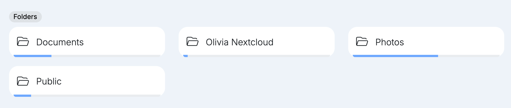
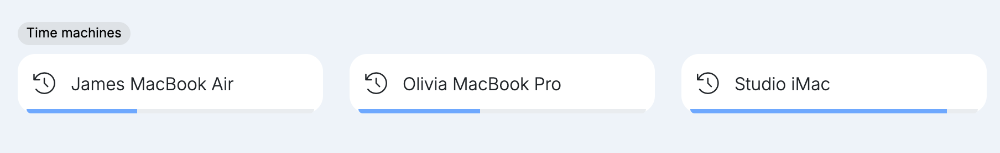
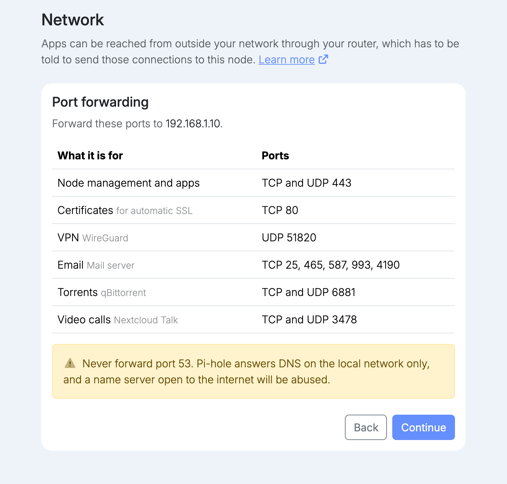

A virgoOS node sits on your own network, next to the computers that use it. This post is about the days when you are not next to it: at home, at a client, on a train. It covers what the VPN does, what it needs, and why the VPN on a node is WireGuard.

## Three ways in from outside

A node can be reached from outside your network in three ways, and each one is for something different.

- **Through your fleet.** At [fleet.univrs.cloud](https://fleet.univrs.cloud) you manage the node from anywhere, and that is all the fleet does. The node connects out to the fleet itself, so this works with no public IP address and no forwarded ports.
- **Through its name.** With port 443 forwarded, the apps open in a browser at their own names. From outside, managing the node and some of the apps ask for a node account first.
- **Through the VPN.** Your phone or laptop joins your network over an encrypted tunnel and is treated as if it were at the office. This is the only one of the three that reaches the node's folders and time machines.

All three are encrypted. What differs is what each one reaches.

## Folders and time machines, from anywhere

Folders and time machines are SMB shares. They are made for the computers on your local network, and they are never put on the internet: there is no port to forward for them. Away from the office, the VPN is the secure way to reach them.

Connected to the VPN, a computer opens a folder at the same address it uses at the office and with the same node username and password. Nothing has to be synced or copied first: the files stay on the node, and you work on them where they are.

The same goes for backups. A Mac that backs up to a time machine on the node keeps doing so over the VPN, so a laptop that spends a week away does not spend a week without a backup.

## The apps, as on your local network

The apps do not need the VPN, since they can be reached from outside at their own names. Over the VPN they behave as they do at the office: the Dashboard opens without signing in, and the apps open without the node's sign-in. Each app still asks for its own account.

The details are in [Authentication](https://docs.univrs.cloud/management/authentication/#on-your-local-network-and-over-the-vpn).

## What it needs

The VPN needs your internet connection to have a public IP address, and one port forwarded on your router to the node: UDP 51820. Setup lists it next to the other ports.

Some providers share one public address between many customers, which is called CGNAT. Behind CGNAT nothing can reach the node from the internet, and the VPN is no exception. Managing the node through your fleet keeps working, and [the ports guide](https://docs.univrs.cloud/setup/ports/) shows how to check which kind of connection you have.

## Installing it

WireGuard is in the App center. Select **Install**, and the form asks for four things:

- **Domain**, filled in with the node's domain. The VPN's own interface is served on the `vpn` name under it, for example `vpn.virgo.univrs.cloud`.
- **HTTPS certificate** for that interface.
- **DNS**, the name server your devices use while connected. With Pi-hole installed, give its address and ads stay blocked over the VPN too.
- **Password** for the interface's administrator.

From outside your network, the interface asks for a node account first and then for its own sign-in.

## Adding a device

Each device gets its own client, created in the VPN's interface. On a phone, install the WireGuard app and scan the client's QR code. On a computer, download the client's configuration file and import it into the WireGuard app. There are apps for Windows, macOS, iOS and Android.

One client per device is what makes this manageable. The interface shows which clients are connected, and a client can be disabled or deleted, so when a phone is lost or someone leaves, you cut off that one device and nobody else has to change anything.

## Why WireGuard

There are older and better known VPNs, OpenVPN first among them. The VPN on a node is WireGuard for a few plain reasons.

- **It is part of Linux.** WireGuard lives inside the Linux kernel, which is what makes it fast on a small server.
- **It is small.** It was designed to be implemented in very few lines of code, so that a single person can review all of it. Less code means fewer places for a flaw to hide.
- **It has nothing to tune.** It uses one fixed set of modern cryptography, so there is no list of ciphers to choose from and no weak option to pick by mistake.
- **It follows you.** When your phone moves from Wi-Fi to mobile data, the connection carries on without you reconnecting.

It has one limit worth knowing. WireGuard runs over UDP only, and it does not try to disguise itself. A network that blocks UDP will not let it through, where OpenVPN, which can also run over TCP, sometimes gets past. For reaching your own node from home or from a phone, the simplicity is worth more.

## Where to go next

- [Port forwarding](https://docs.univrs.cloud/setup/ports/) lists every port and explains CGNAT.
- [Folders](https://docs.univrs.cloud/management/resources/folders/) and [Time machines](https://docs.univrs.cloud/management/resources/time-machines/) cover creating them and copying their addresses.
- [Apps](https://docs.univrs.cloud/management/resources/apps/) covers installing from the App center.
- [What virgoOS is, and what runs on it](/blog/what-virgoos-is/) is the short tour of everything else.
