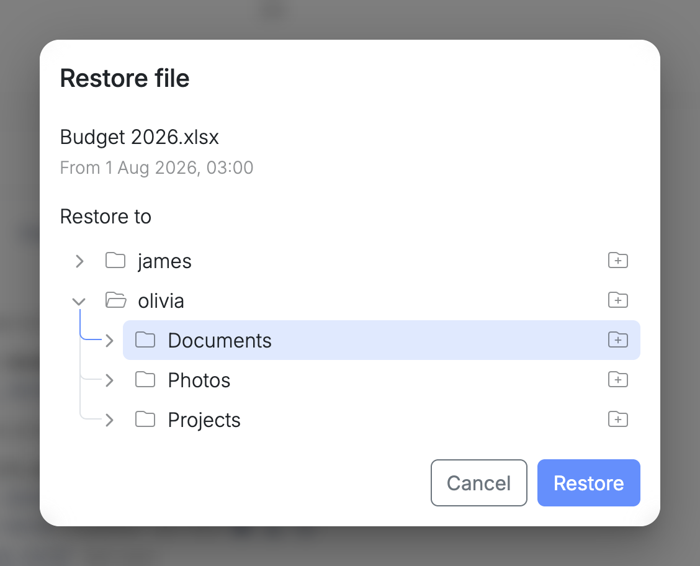
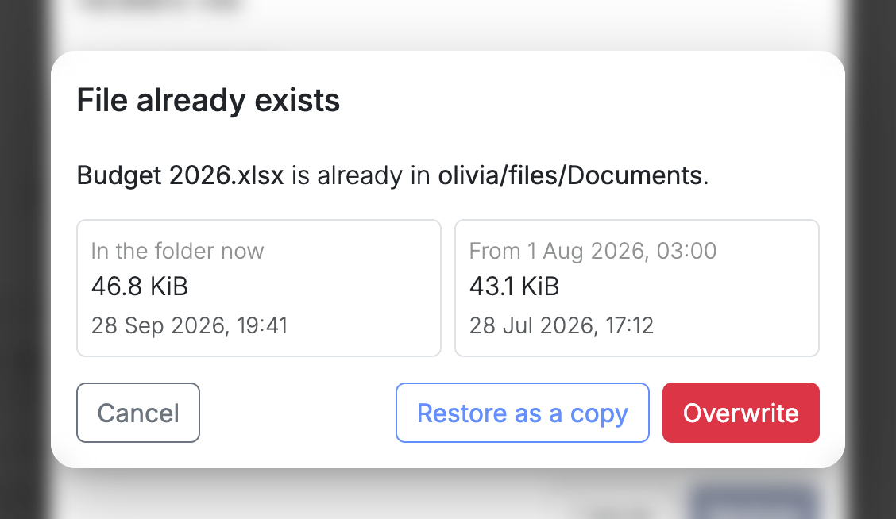
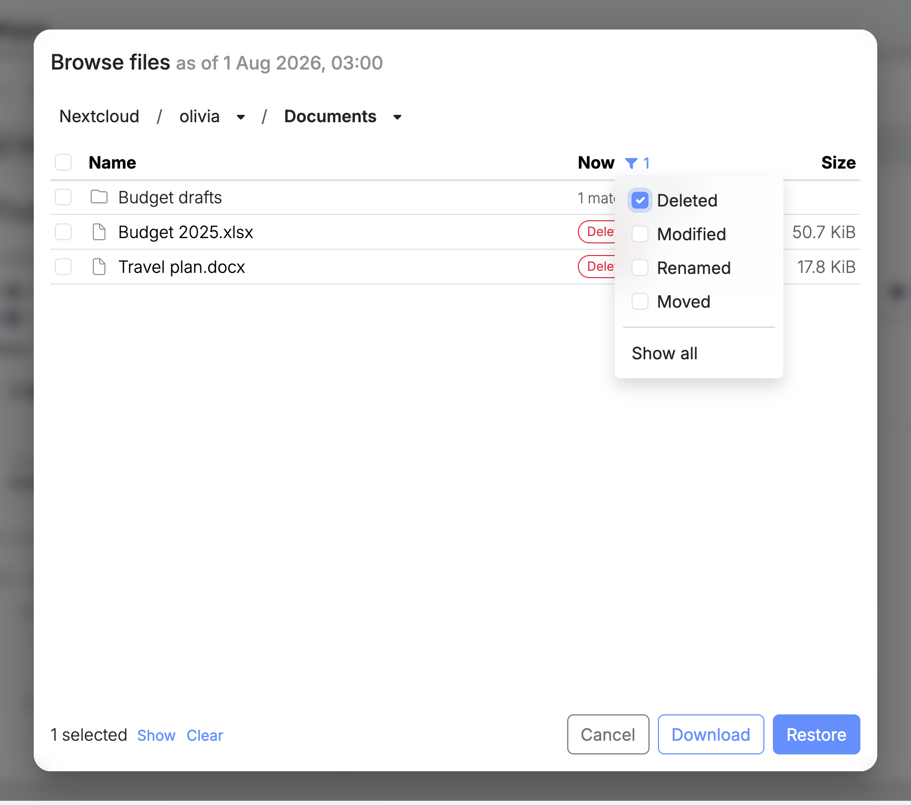

Este sfârșit de septembrie și Olivia deschide bugetul firmei. Cifrele stabilite în vară nu mai sunt acolo: între timp cineva a lucrat peste fișier, de mai multe ori, și a salvat. Nu s-a șters nimic, deci coșul este gol, și nimeni nu mai știe în ce zi s-a întâmplat.

Cu Nextcloud pe un nod virgoOS, asta se rezolvă în câteva minute. Articolul urmărește totul de la început până la sfârșit, apoi face același lucru pentru un folder întreg.

## De ce nu ajunge coșul

Nextcloud are un coș, iar pentru un fișier șters săptămâna trecută acolo vă uitați mai întâi. Coșul păstrează fișierele șterse cel puțin 30 de zile, iar cine a șters fișierul îl poate scoate singur de acolo, fără să ceară ajutorul nimănui.

Pentru bugetul Oliviei, coșul nu ajută. Fișierul nu a fost șters, ci modificat, iar în coș ajunge doar ce a fost aruncat. Nu ajută nici pentru un fișier șters primăvara, de care vă amintiți abia toamna.

Pentru astfel de cazuri există stratul de dedesubt. Pool-ul de stocare al nodului face câte un snapshot pentru fiecare dintre ultimele 36 de ore, 30 de zile, 60 de luni și 5 ani. Fiecare este o copie doar pentru citire a datelor, așa cum erau în acel moment. În detaliile unei aplicații, ele apar ca puncte de restaurare, pe o axă a timpului, în **Snapshots**.

Toate aplicațiile au puncte de restaurare, dar numai cele ale aplicației Nextcloud pot fi deschise pentru a recupera fișiere. Tot ce urmează se referă la fișierele pe care oamenii le țin în Nextcloud.

## Îl găsiți după nume

Nimeni nu știe când s-a stricat bugetul, dar toată lumea știe cum se numește. Este de ajuns.

În detaliile aplicației Nextcloud, în **Snapshots**, scrieți o parte din nume în **Search in snapshots** și apăsați Enter. Căutarea trece prin toate punctele de restaurare deodată: fișierele fiecărui utilizator, ce are fiecare în coș și folderele de grup.

Sub fiecare fișier găsit sunt punctele de restaurare care păstrează o versiune a lui, cu ce s-a întâmplat cu el acolo și cu dimensiunea. Pentru `Budget 2026.xlsx`, lista se citește ca o scurtă istorie: adăugat la 1 ianuarie, modificat până la 1 august, modificat din nou pe 16 și pe 28 septembrie. Olivia are nevoie de versiunea din august.

Căutarea este posibilă pentru că nodul cataloghează singur fișierele din snapshoturile Nextcloud, din oră în oră, la și zece. Nu aveți nimic de activat.

## Puneți la loc o versiune

Fiecare versiune are lângă ea două butoane: unul o descarcă pe calculatorul dumneavoastră, celălalt o restaurează în Nextcloud.

Apăsați butonul de restaurare al versiunii din 1 august. Se deschide **Restore file**, cu folderul în care se afla fișierul deja selectat, așa că de obicei doar confirmați. Puteți alege și alt folder, al oricărui utilizator Nextcloud, sau puteți adăuga unul nou.

Bugetul există încă în acel folder, în forma din septembrie, așa că nodul nu restaurează deocamdată nimic. Vă arată cele două fișiere unul lângă altul, fiecare cu dimensiunea și cu data ultimei modificări, și vă întreabă ce să facă.

**Restore as a copy** păstrează fișierul existent și îl pune lângă el pe cel din august, cu numele `Budget 2026 (restored 1 Aug 2026).xlsx`. Nu se pierde nimic, iar Olivia le poate compara. **Overwrite** înlocuiește fișierul din septembrie cu cel din august.

În ambele cazuri, fișierul apare singur în Nextcloudul Oliviei. Punctul de restaurare rămâne neatins, deci aceeași versiune poate fi restaurată din nou.

## Când e vorba de mai multe fișiere

Uneori nu numele este ce știți. Știți că cineva a făcut curat într-un folder cu prea mult zel sau că o sincronizare a mers prost într-o anumită zi. Atunci porniți de la dată.

Alegeți un punct de restaurare de dinainte și apăsați **Browse files**. Se deschide Nextcloud așa cum era atunci, utilizator cu utilizator și folder cu folder. Coloana **Now** compară fiecare element cu ce are Nextcloud astăzi: neschimbat, modificat, redenumit, mutat sau șters.

Un folder mare este plin de fișiere neschimbate, așa că această coloană are un filtru. Bifați **Deleted**, iar lista arată doar ce a fost șters de atunci, cu un număr în dreptul fiecărui folder care are astfel de fișiere undeva în interior.

Cu filtrul pornit, bifarea unui folder selectează doar fișierele din el care se potrivesc, oricât de adânc ar fi. Selecția se păstrează cât timp navigați, așa că puteți aduna dintr-o singură trecere fișiere din mai multe foldere și de la mai mulți utilizatori.

**Restore** le pune apoi pe toate în folderul pe care îl alegeți, într-un folder nou, numai al lor, care poartă data punctului de restaurare, de exemplu `Restore (1 Aug 2026)`.

O selecție ajunge întotdeauna într-un folder al ei, deci nimic din ce este acum în Nextcloud nu este înlocuit. Omul îl deschide, mută ce îi trebuie acolo unde vrea și șterge restul. Merge și atunci când locul de origine nu mai există: fișierele unui coleg care a plecat pot fi restaurate la cineva care a rămas.

Tot pe aici o luați dacă un ransomware criptează fișierele. Punctele de restaurare sunt doar pentru citire, așa că cele de dinainte păstrează fiecare fișier așa cum era.

## Cât de departe în urmă

Punctele de restaurare recente sunt dese, iar cele vechi sunt rare. O modificare de azi poate fi anulată cu precizie de o oră, iar una din luna aceasta, cu precizie de o zi. Un fișier de acum doi ani există așa cum era la începutul unei luni sau al unui an.

O versiune care a existat doar între două puncte de restaurare nu a fost prinsă niciodată. Ce a fost scris și suprascris în aceeași oră nu se regăsește în istoric.

Descărcarea mai cere un lucru: nu este disponibilă când administrați nodul prin fleet, așa că pentru ea deschideți nodul la propria lui adresă. Restaurarea funcționează în ambele cazuri.

## Ce urmează

- [Snapshots](https://docs.univrs.cloud/management/resources/apps/snapshots/), în limba engleză, descrie punctele de restaurare și axa timpului.
- [Searching files](https://docs.univrs.cloud/management/resources/apps/snapshots/search/), [Browsing files](https://docs.univrs.cloud/management/resources/apps/snapshots/browse/) și [Restoring files](https://docs.univrs.cloud/management/resources/apps/snapshots/restore/), în limba engleză, descriu pe larg fiecare pas.
- [Nextcloud pe propriul nod sau OneDrive](/ro/blog/nextcloud-or-onedrive/) compară acest istoric cu ce păstrează un furnizor de cloud.
