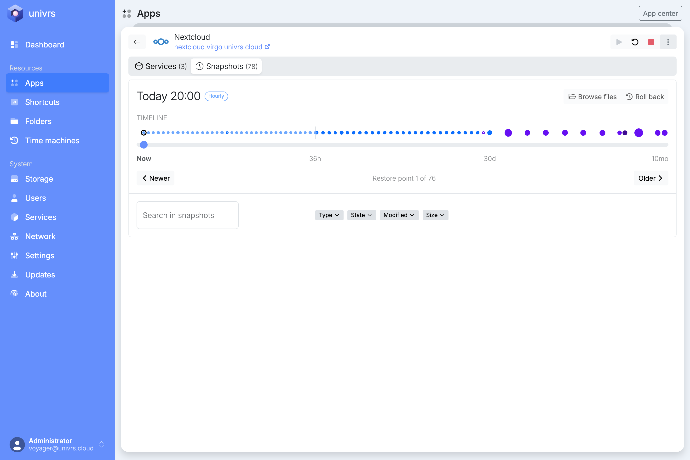
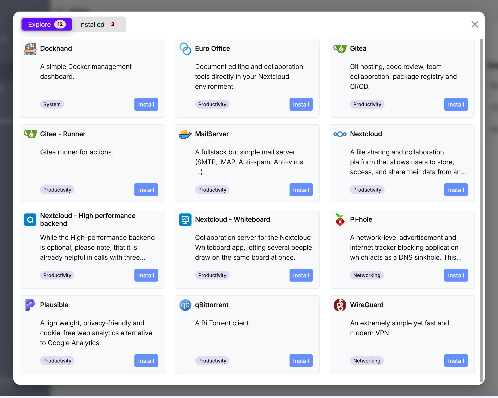

virgoOS este un sistem de operare făcut pentru un singur lucru: să găzduiască fișierele, e-mailul și uneltele dumneavoastră de lucru în echipă pe un server care vă aparține, fără ca cineva să fie nevoit să administreze manual acel server. Este în întregime open source.

Un echipament pe care rulează virgoOS se numește nod. Articolul acesta arată ce face un nod, începând cu prima pornire.

## Configurarea, o singură dată

La prima pornire, nodul rulează configurarea într-un browser. Configurarea stabilește rețeaua, creează pool-ul de stocare, înregistrează nodul în contul dumneavoastră de fleet, instalează aplicațiile de bază și înlocuiește parola implicită. La final, administrați nodul autentificându-vă la adresa lui, de exemplu `https://spica.virgo.univrs.cloud`.

Un nod are nevoie de cel puțin două discuri de date de aceeași capacitate și de cel puțin 8 GB de RAM. [Ghidul de configurare](https://docs.univrs.cloud/setup/), în limba engleză, descrie fiecare pas.

## Stocare care păstrează un istoric

Totul stă pe un pool ZFS redundant. În funcție de câte discuri are nodul, configurarea oferă variante de la mirror la RAID-Z3, care rezistă la defectarea a unu până la trei discuri.

Pool-ul își păstrează și propriul istoric. Nodul face câte un snapshot pentru fiecare dintre ultimele 36 de ore, 30 de zile, 60 de luni și 5 ani și le șterge singur pe cele mai vechi. Un snapshot este o copie doar pentru citire a datelor, așa cum erau la un moment dat, și ocupă spațiu doar pentru ce s-a schimbat de atunci.

Datorită acestui istoric, un fișier șters sau criptat poate fi recuperat. Indexerul cataloghează din oră în oră fișierele din snapshoturi, așa că puteți căuta versiuni mai vechi sau șterse ale unui fișier din snapshoturile unei aplicații.

O dată pe lună, pool-ul își citește toate datele, le verifică după sumele de control și repară tot ce nu corespunde.

## Aplicații din App center

Trei aplicații de bază se instalează la configurare: Traefik, care direcționează cererile către aplicații și se ocupă de certificatele lor SSL, Authelia, care gestionează conturile nodului, și un terminal în browser.

Restul vin din App center:

- **Nextcloud** pentru fișiere, cu Euro Office pentru lucrul în echipă la documente, un backend de înaltă performanță pentru apeluri și o tablă virtuală.
- **Un server de e-mail** pe domeniul dumneavoastră, cu filtrare antispam și antivirus.
- **WireGuard** pentru o conexiune criptată din afara rețelei.
- **Pi-hole** pentru blocarea reclamelor și a trackerelor în toată rețeaua.
- **Gitea**, **Plausible**, **qBittorrent** și **Dockhand** pentru cine are nevoie de ele.

Fiecare aplicație își păstrează datele pe pool și este accesibilă la propria adresă, sub domeniul nodului.

## Administrat de oriunde

Înregistrarea leagă nodul de contul dumneavoastră de fleet, la [fleet.univrs.cloud](https://fleet.univrs.cloud). Nodul se conectează singur la fleet, deci îl puteți administra de oriunde, chiar și atunci când se află în spatele CGNAT, fără adresă IP publică și fără porturi redirecționate.

Asta acoperă administrarea nodului. Accesul la ce rulează pe el este altceva: e-mailul, partajarea fișierelor din Nextcloud cu alte persoane, VPN-ul și deschiderea aplicațiilor din afara rețelei locale au nevoie de o conexiune la internet cu adresă IP publică și de [câteva porturi redirecționate](https://docs.univrs.cloud/setup/ports/) în router. Fără ele, aplicațiile funcționează doar în rețeaua locală.

## Ce urmează

- Imaginile de instalare sunt pe [pagina cu versiunile](https://github.com/univrs-cloud/virgo/releases/latest).
- [Documentația](https://docs.univrs.cloud/), în limba engleză, acoperă configurarea, fiecare pagină de administrare și comanda `virgo`.
- Codul sursă este la [github.com/univrs-cloud](https://github.com/univrs-cloud), sub licența GNU General Public License, versiunea 2.
